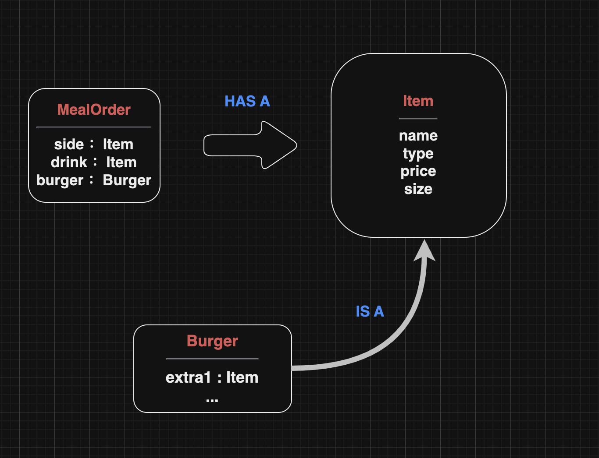

## Welcome to the Object-Oriented Programming Master Challenge!

### Bill's Burger Challenge

- Bill有一家快餐汉堡店

- 菜单有三道菜组成，汉堡包、饮料、配菜

- 应用允许bill选择汉堡的类型、可以添加到汉堡中的一些附加项目，或附加内容、实际定价

#### 要点

- 订单由一个汉堡、一种饮料、一种配菜组成

- 饮料
  
    - type 类型
    - size 尺寸
    - price 价格
    - 价格随着尺寸改变

- 配菜
  
    - type 类型
    - price 价格

- 汉堡
  
    - type 类型
    - price 价格
    - 额外的三个toppings

#### My diagram design
    
饮料和配菜的差别只是少了个size的可选，汉堡当中需要额外的三个toppings，且toppings也具有类型、价格  

因此可以将饮料和配菜向上抽取出一个共同类`Item`。

